* [**Introduction**](introduction)

* [**Manual**](manual)

* [**Tutorial**](tutorial)

* [**Case Study**](case study)

* [**Paper Materials**](paper materials)

# Case Study

We selected 9 examples for case study, of which case.1 was presented in our paper and many of the remaining were selected from existing papers.

Users can click the **Load Tree** button of the interface and load them under the project's **examples** folder

## [](#header-2) **CASE1: Recharge, Monitoring, and Answer**
### [](#header-3)**(1) Description**
This BehaviorTree is from our paper, it specifies that the robot can simultaneously recharge while monitoring for a user ask and providing an answer. 

The robot's tasks can be divided into three parts: Recharge, Monitor, and Answer, which run in parallel.
For the Recharge part, if the robot's battery level is above 10% while the robot is not under recharging, the robot does not need to recharge immediately.
In other cases, the robot must recharge or keep recharging until the battery level reaches 100%. 
Robot increases its charge by 1% for every 10 time units that pass while recharging.
In the Monitor and Answer parts to facilitate the answer response, we implemented a communication by using a shared variable **a**.
When the action node Monitoring succeeds, it sets _a_ to 1.
The condition node Ask only returns success when _a_ equals 1, which enables the execution of the action node Answer.
After the successful execution of Answer, _a_ is set to 0.
### [](#header-3)**(2) Behavior Tree**
<br>
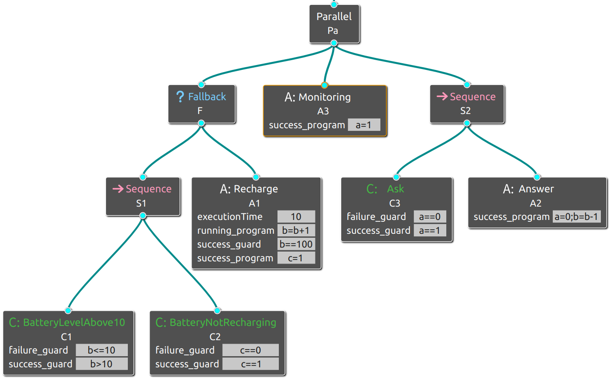
<br>

### [](#header-3)**(3) Variables**
```
Name:  a (user ask?)               Name:  b (battery level)   
Value: 0,1                         Value: [0,100]     
Meaning:  0: no.  1: yes.          Meaning:  battery level range from 0% to 100%.
Initial Value: 1                   Initial Value: 5
```
```
Name:  c (recharging status)              
Value: 0,1     
Meaning:  0: in recharging.  1: not in recharging.
Initial Value: 1
```

### [](#header-3)**(4) Property**

#### [](#header-4)1**.LTL property**
```
a=1,b=5,c=1 
```
```
#assert BehaviorTree |= G (BatteryLevelAbove10_f -> X(Recharge_s  || Recharge_f || Recharge_r));
```
This assert means that once the robot's battery level drops below 10% ,Recharge should be the next action.


#### [](#header-4)2**.Timed behavior property**

Verification setting: 
```
a=1,b=20,c=0  Deadline Time:300
```
```
#define  goal1  b==40 ;
#define  goal2  b==60 ;
#assert DeadlineProcess reaches goal1;
#assert DeadlineProcess reaches goal2;
```

We defined two battery level goals, and use this two asserts to check if the robot can be charged to 40% or 60%.


### [](#header-3)**(5) Result**

#### [](#header-4)(a)**LTL property verification result**

<div style="display: flex; justify-content: center;">
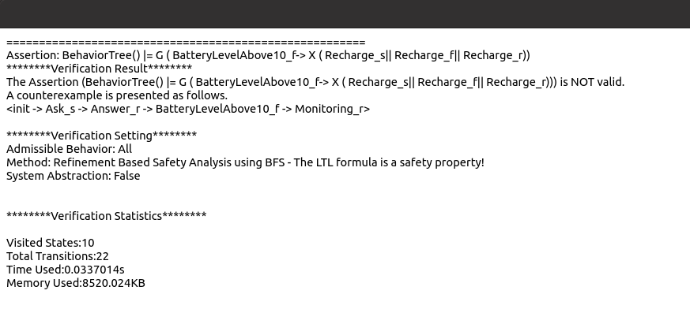
</div>

The verification result  is not valid with a counterexample path. 
This counterexample implies that even if the robot's battery level is below 10%, it may still execute other parallel tasks, such as nodes **Monitoring**, 
**Ask**, and **Answer**. 

Therefore, we can add a requirement such that nodes **Monitoring**, **Ask**, and **Answer** cannot be executed when the battery level is below 10%.
We can achieve this by adding a **guard** _b > 10_ to these three nodes. 
The image below is the new BehaviorTree: 
<div style="display: flex; justify-content: center;">
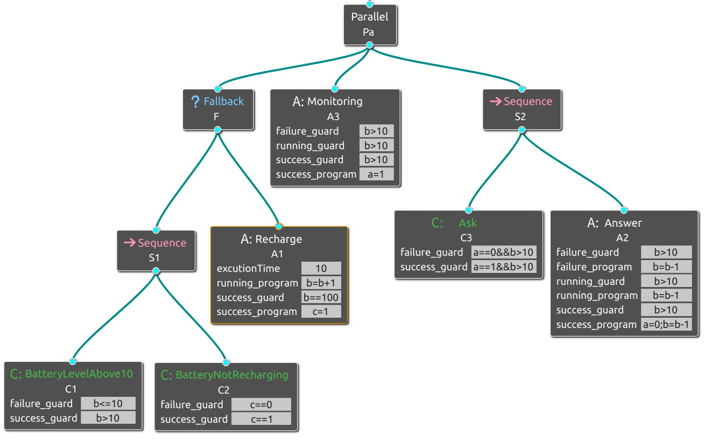
</div>

After modifying the BT, the verification result is valid. Therefore, we construct a better BT by utilizing the counterexample.

#### [](#header-4)(a)**Timed behavior property verification result**
<div style="display: flex; justify-content: center;">
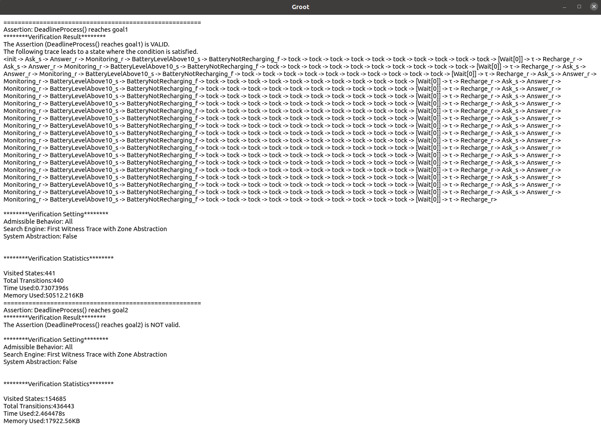
</div>
Verification results indicate that goal1 is reachable, while goal2 is unreachable, 
which means that the robot can be charged up to 40% within 300 units of time, but it is not possible for it to reach 60%. 

## [](#header-2) **CASE2: Pick and Place(1)**
### [](#header-3)**(1) Description**
This BT requires a robot to pick up a cube at point A and then place it at point B.
The BT's execution can be divided into two phases: the left side is the Pick phase, and the right is the Place phase. 
The BT first checks whether **Picked** holds for the Pick phase. 
If it does, the BT executes the Place phase; 
otherwise, it checks **AtA**. 
If it holds, the BT can perform **PickUp** directly; 
Otherwise, the BT drives the robot first to execute **GoToA**, and then perform **PickUp**. 
The BT first checks whether **Placed** holds for the Place phase. 
If it does, the robot has completed the task; Otherwise, the BT checks whether **AtB** holds. 
If it does, the BT can perform **Place** directly; Otherwise, the BT should first execute **GoToB**, and then perform **Place**.

### [](#header-3)**(2) Behavior Tree**
<div style="display: flex; justify-content: center;">
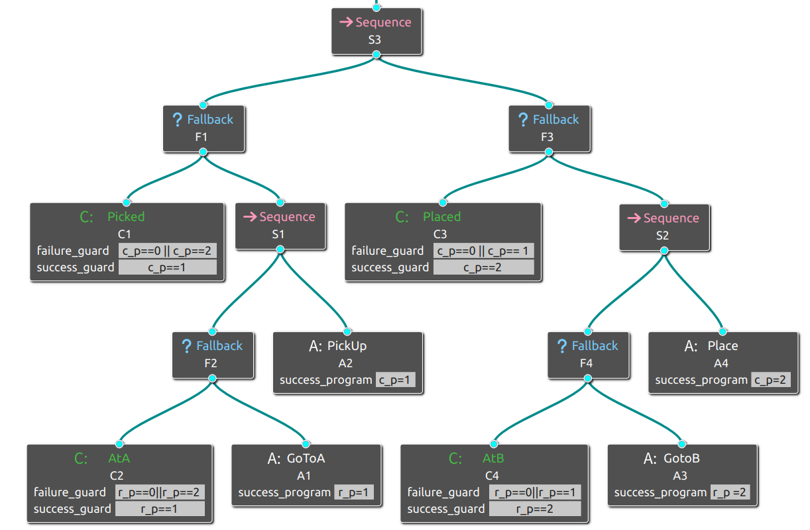
</div>

### [](#header-3)**(3) Variables**
```
Name:  c_p (cube position)              
Value: 0,1,2      
Meaning:  0: neither at A nor at B.  1: at A.  2:at B.
Initial Value: 0
```
```
Name:  r_p (robot position)              
Value: 0,1,2      
Meaning:  0: neither at A nor at B.  1: at A.  2:at B.
Initial Value: 0
```

### [](#header-3)**(4) Property**
```
#assert  BehaviorTree |= G ( (Picked_s||PickUp_s)   R  !Placed_s  ) ;
```
This assert means the robot can't place down the cube until it has successfully picked up the cube.
But the robot may not be able to finally get the cube, 
because the action **GotoA** and **PickUp** may always return **running** or **failure** (or you can add **success threshold** to these two nodes to guarantee that they will return success).


### [](#header-3)**(5) Result**

<div style="display: flex; justify-content: center;">
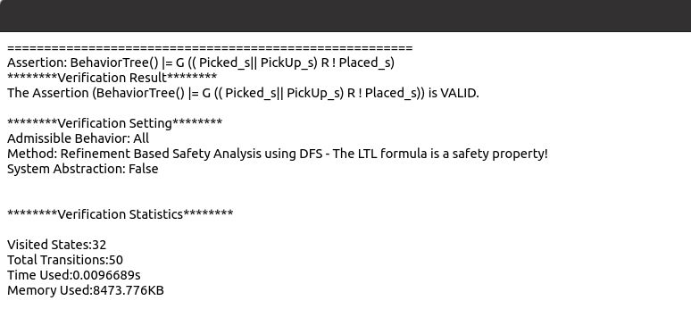
</div>

## [](#header-2) **CASE3: Pick and Place(2)**
### [](#header-3)**(1) Description**
This  BehaviorTree is from paper [Towards Blended Reactive Planning and Acting using Behavior Trees](https://dl.acm.org/doi/10.1109/ICRA.2019.8794128) (Figure 3(e) in this paper).

The robot is asked to pick up a cube from one location and place it in another.
And the movement of the robot requires a collision free path.
### [](#header-3)**(2) Behavior Tree**
<div style="display: flex; justify-content: center;">
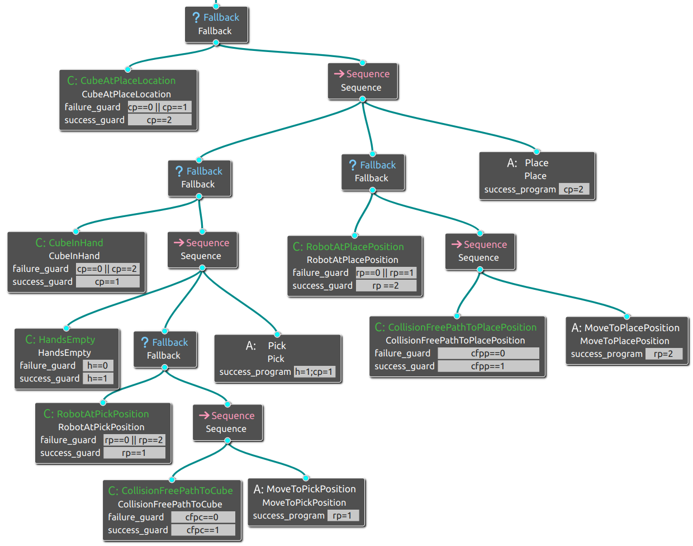
</div>

### [](#header-3)**(3) Variables**
```
Name: cp (cube position?)                                       Name:  rp (robot position?)     
Value: 0,1,2                                                    Value: 0,1,2                          
Meaning: 0: unkown. 1: in robot's hand. 2: at place position.   Meaning: 0: unkown. 1: pick position. 2: place position.    
Initial Value: 0                                                Initial Value: 0            
```
```
Name:  cfpp (collsion free path to place position exist?)       Name: cfpc (collsion free path to cube exist?)      
Value: 0,1,                                                     Value: 0,1                      
Meaning:  0: no.  1: yes.                                       Meaning:  0: no.  1: yes.       
Initial Value: 1                                                Initial Value: 1                 
```
```
Name: h (robot hands empty?)       
Value: 0,1                      
Meaning:  0: no.  1: yes.       
Initial Value: 0           
```
### [](#header-3)**(4) Property**
```
#assert BehaviorTree |= G (HandsEmpty_f -> ((!Pick_s U HandsEmpty_s) || G !Pick_s)) ; 
```
This assert means that when the robot's hand is not empty, it cannot pick up the cube until its hand is empty.

### [](#header-3)**(5) Result**
<div style="display: flex; justify-content: center;">
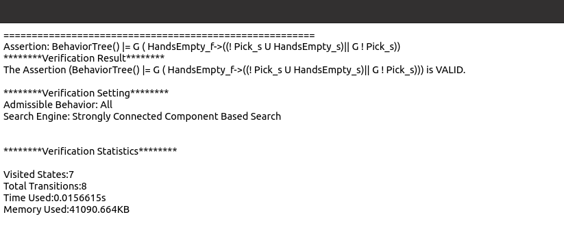
</div>

## [](#header-2) **CASE4: Alarm**
### [](#header-3)**(1) Description**
periodically do taskA (if Alarm) or do taskB (if no alarm).

### [](#header-3)**(2) Behavior Tree**
<div style="display: flex; justify-content: center;">
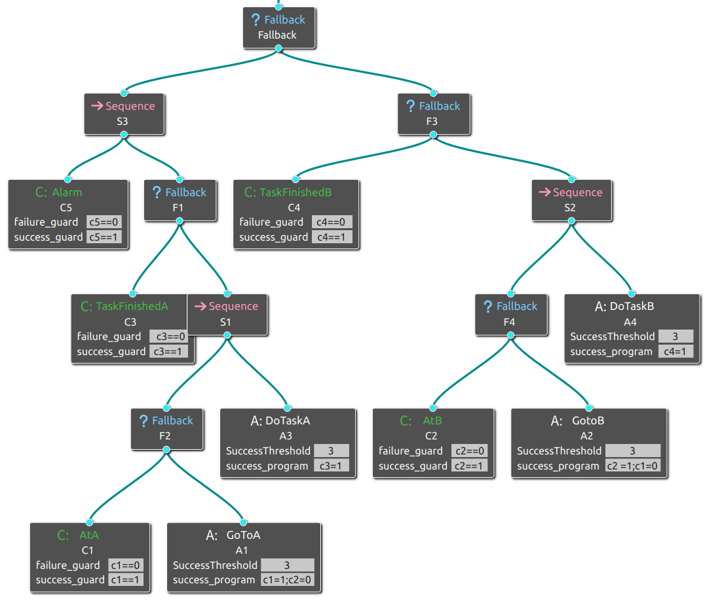
</div>

### [](#header-3)**(3) Variables**
```
Name:  c1 (Robot at A?)                   Name:  c2 (Robot at B?)  
Value: 0,1                                Value: 0,1                       
Meaning:  0: at A.  1: not at A.          Meaning:  0: at B.  1: not at B.
Initial Value: 0                          Initial Value: 0
```
```
Name:  c3 (Task A finished ?)             Name:  c4 (Task B finished ?)       Name:  c5 (Alarm ?)
Value: 0,1                                Value: 0,1                          Value: 0,1
Meaning:  0: no.  1: yes.                 Meaning:  0: no.  1: yes.           Meaning:  0: no.  1: yes.
Initial Value: 0                          Initial Value: 0                    Initial Value: 0
```

### [](#header-3)**(4) Property**
```
#assert BehaviorTree |= G (Alarm_s -> ((!DoTaskB_s U Alarm_f) || G !DoTaskB_s)) &&  G (Alarm_f -> ((!DoTaskA_s U Alarm_s) || G !DoTaskA_s)); 
```
This assert means task B cannot be done when there is an alarm, and task A cannot be done when it is not an alarm.


### [](#header-3)**(5) Result**
<div style="display: flex; justify-content: center;">
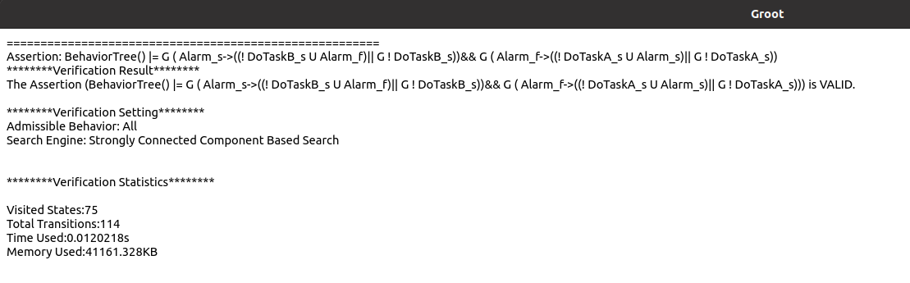
</div>


## [](#header-2) **CASE5: Fetch Bottle**
### [](#header-3)**(1) Description**
This  BehaviorTree is from paper [Conditional Behavior Trees: Definition, Executability, and Applications](https://dl.acm.org/doi/10.1109/SMC.2019.8914358) (Figure 1 in this paper).

The robot is asked to go to the kitchen to get the bottle, and if it cannot complete it, it should ask human for help.
### [](#header-3)**(2) Behavior Tree**
<div style="display: flex; justify-content: center;">
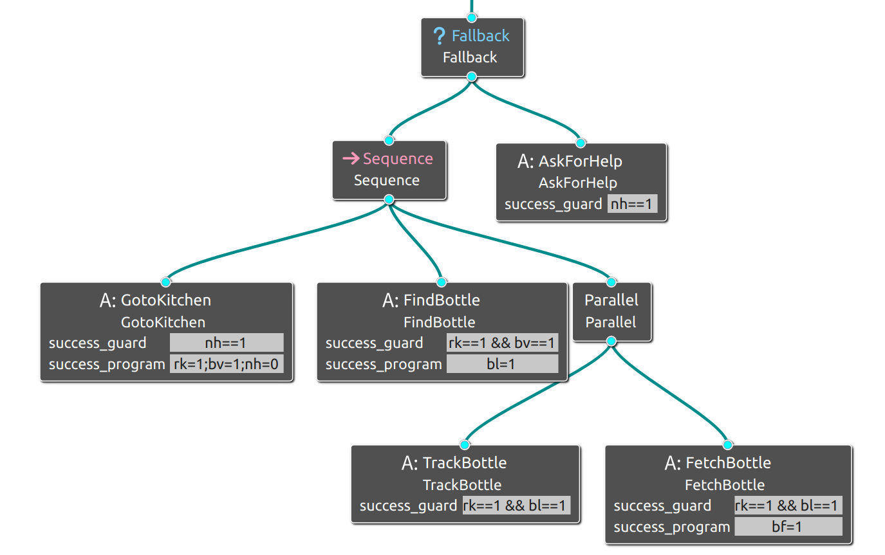
</div>

### [](#header-3)**(3) Variables**
```
Name: rk (robot in kitchen?)    Name: bv (bottle bisible?)  
Value: 0,1                      Value: 0,1                       
Meaning:  0: no.  1: yes.       Meaning: 0: no.  1: yes.
Initial Value: 0                Initial Value: 1
```
```
Name:  bl (bottle located?)     Name: bf (bottle fetched?)       Name:  nh (robot near human?)
Value: 0,1                      Value: 0,1                       Value: 0,1
Meaning:  0: no.  1: yes.       Meaning:  0: no.  1: yes.        Meaning:  0: no.  1: yes.
Initial Value: 1                Initial Value: 0                 Initial Value: 0
```

### [](#header-3)**(4) Property**
```
#assert BehaviorTree |= G (GotoKitchen_s -> X(FindBottle_s  || FindBottle_f || FindBottle_r));
```
This assert means that only after the robot has successfully entered the kitchen can it find the bottle.


### [](#header-3)**(5) Result**
<div style="display: flex; justify-content: center;">
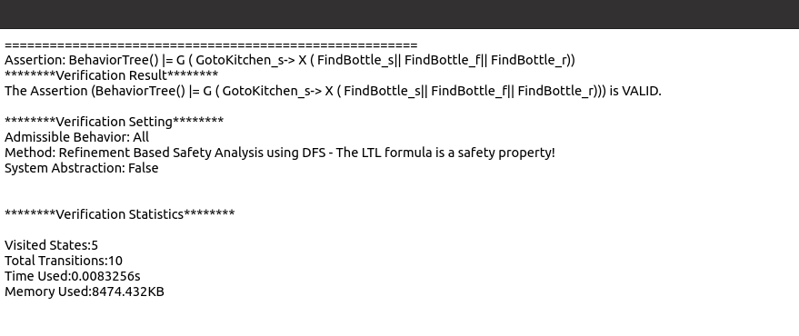
</div>

## [](#header-2) **CASE6: Get Food**
### [](#header-3)**(1) Description**
This BehaviorTree is from paper [Improving the Performance of Backward Chained Behavior Trees that use Reinforcement Learning](https://arxiv.org/abs/2112.13744) (Figure 2 in this paper).

When the agent has no food, it will first consider picking apples. If there are no apples nearby to pick, it will consider killing cows. 
Killing cows needs to meet the two conditions of having a sword in hand and being close to cows.
### [](#header-3)**(2) Behavior Tree**
<div style="display: flex; justify-content: center;">
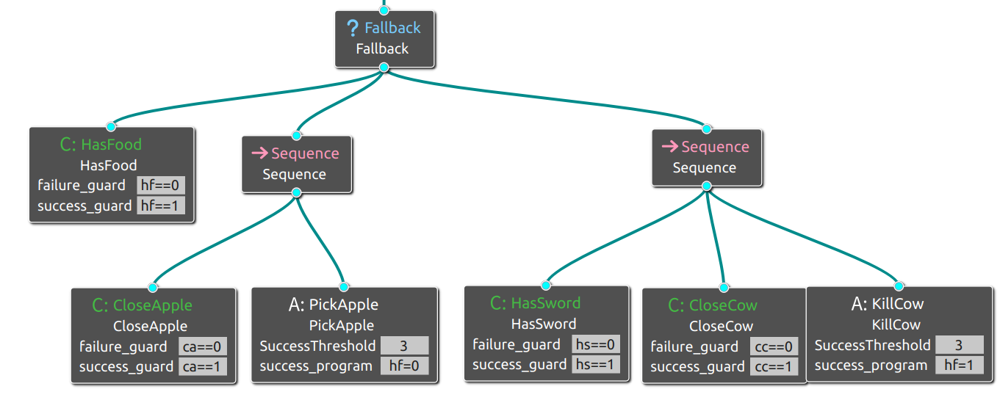
</div>

### [](#header-3)**(3) Variables**
```
Name: hf (has food?)            Name: ca (close to apple?)  
Value: 0,1                      Value: 0,1                       
Meaning:  0: no.  1: yes.       Meaning: 0: no.  1: yes.
Initial Value: 0                Initial Value: 0
```
```
Name:  hs (has sword?)          Name: cc (close to cow?)      
Value: 0,1                      Value: 0,1                      
Meaning:  0: no.  1: yes.       Meaning:  0: no.  1: yes.       
Initial Value: 1                Initial Value: 1                 
```

### [](#header-3)**(4) Property**
```
#assert BehaviorTree |= F HasFood_s;
```
This assert means that the agent will eventually get food.


### [](#header-3)**(5) Result**
<div style="display: flex; justify-content: center;">
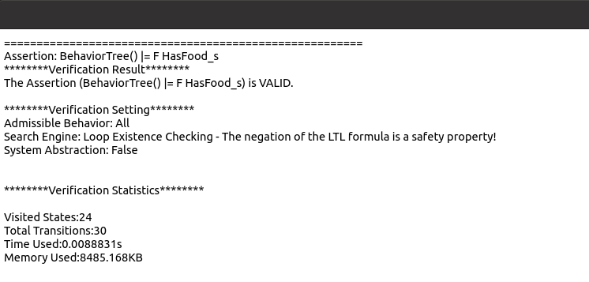
</div>

## [](#header-2) **CASE7: Mars-Rover**
### [](#header-3)**(1) Description**
This BehaviorTree is from paper [A Framework for Formal Verification of Behavior Trees With Linear Temporal Logic](https://ieeexplore.ieee.org/document/8977342) (Figure 1 in this paper).

Mars-Rover unfold the solar panels when the battery is low, fold the solar panels when there is a storm, 
collects and sends data when the battery is not low and there is no storm.
### [](#header-3)**(2) Behavior Tree**
<div style="display: flex; justify-content: center;">
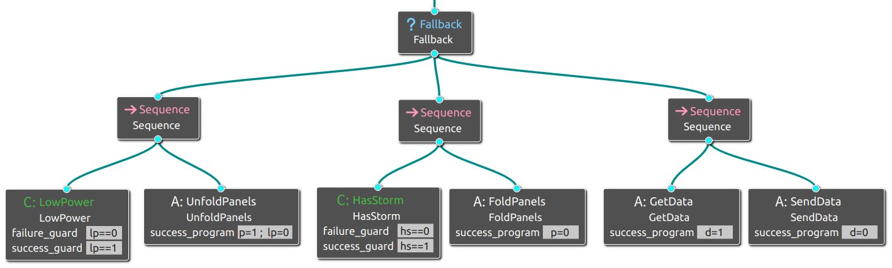
</div>

### [](#header-3)**(3) Variables**
```
Name: lp (low power?)           Name: p (Panels fold?)  
Value: 0,1                      Value: 0,1                       
Meaning:  0: no.  1: yes.       Meaning: 0: no.  1: yes.
Initial Value: 0                Initial Value: 0
```
```
Name:  hs (has storm?)          Name: d (has data?)      
Value: 0,1                      Value: 0,1                      
Meaning:  0: no.  1: yes.       Meaning:  0: no.  1: yes.       
Initial Value: 0                Initial Value: 0               
```

### [](#header-3)**(4) Property**
```
#assert BehaviorTree |= G (GetData_s -> X(SendData_s  || SendData_f || SendData_r));
```
This assert means that only after the Mars-Rover has successfully got the data can it perform send data.

### [](#header-3)**(5) Result**
<div style="display: flex; justify-content: center;">
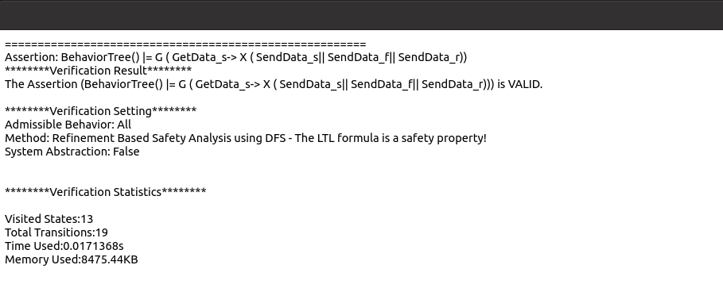
</div>


## [](#header-2) **CASE8: Mars-Rover GetData BT Refinement**
### [](#header-3)**(1) Description**
This behavior tree is a refinement of **GetData** in **Mars-Rover**  (Figure 2 in paper [Improving the Performance of Backward Chained Behavior Trees that use Reinforcement Learning](https://arxiv.org/abs/2112.13744) ).

Assume that the Mars-Rover must actively find
rock samples and bring them to a base station to be analysed. 
Occasionally a component on the base station will break, which the robot must fix before it can analyze any new rocks.
### [](#header-3)**(2) Behavior Tree**
<div style="display: flex; justify-content: center;">
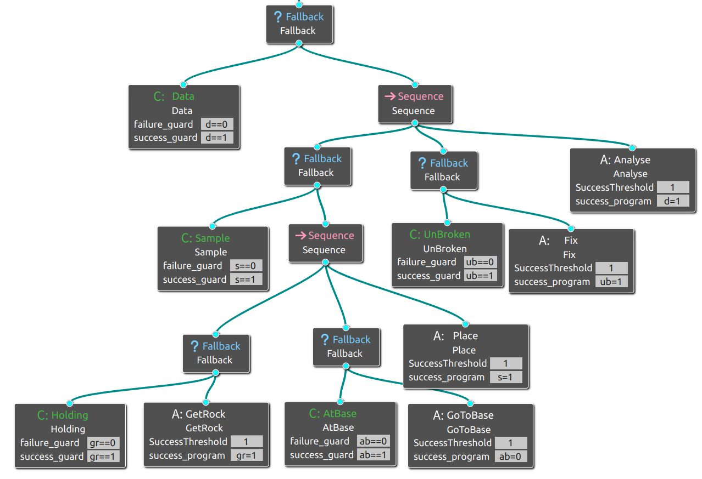
</div>


### [](#header-3)**(3) Variables**
```
Name: d (has data?)            Name: s (has sample?)       Name: gr (get rock?)  
Value: 0,1                     Value: 0,1                  Value: 0,1              
Meaning:  0: no.  1: yes.      Meaning: 0: no.  1: yes.    Meaning: 0: no.  1: yes.
Initial Value: 0               Initial Value: 0            Initial Value: 0
```
```
Name:  ab (at base?)           Name: ub (component unbroken?)      
Value: 0,1                     Value: 0,1                      
Meaning:  0: no.  1: yes.      Meaning:  0: no.  1: yes.       
Initial Value: 0               Initial Value: 0               
```

### [](#header-3)**(4) Property**
```
#assert BehaviorTree |= G (UnBroken_f -> X(Fix_s  || Fix_f || Fix_r)) && F Data_s  ;
```
This assert means that once the Mars-Rover finds that the component is broken, it should fix it immediately, and the Mars-Rover can eventually get the data.

### [](#header-3)**(5) Result**
<div style="display: flex; justify-content: center;">
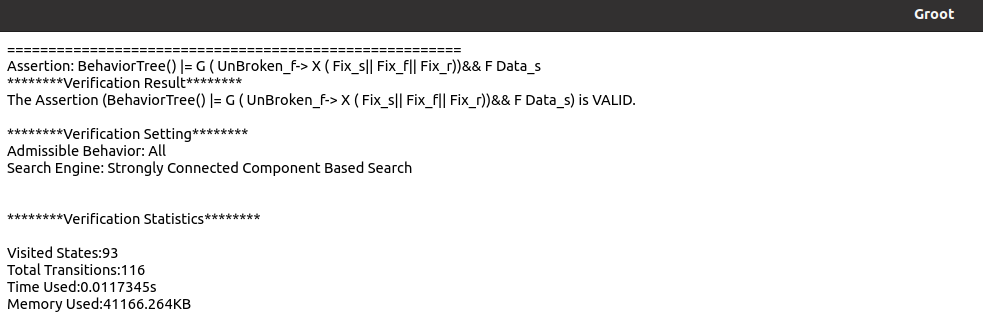
</div>


## [](#header-2) **CASE9: Patrol**
### [](#header-3)**(1) Description**
The robot is asked to infinitely visit position A, B and C.

### [](#header-3)**(2) Behavior Tree**
<div style="display: flex; justify-content: center;">
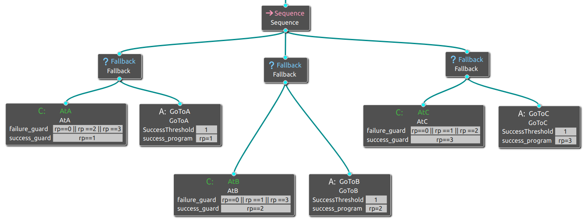
</div>

### [](#header-3)**(3) Variables**
```
Name:  rp (robot position?)                                     
Value: 0,1,2,3                                                                          
Meaning: 0: unkown. 1: At A. 2: At B. 3: At C. 
Initial Value: 0                                                           
```

### [](#header-3)**(4) Property**
```
#assert BehaviorTree |= G F GoToA_s && G F GoToB_s && G F GoToC_s ;
#assert BehaviorTree |=G (F (GoToA_s && (F (GoToB_s && F GoToC_s)))) && ((!GoToB_s && !GoToC_s) U GoToA_s) && (!GoToC_s U GoToB_s) ;
```
This first assert means that the robot's will eventually visit position A, B and C.
This second assert means that the robot's will visit position A, B and C in order.
### [](#header-3)**(5) Result**
<div style="display: flex; justify-content: center;">
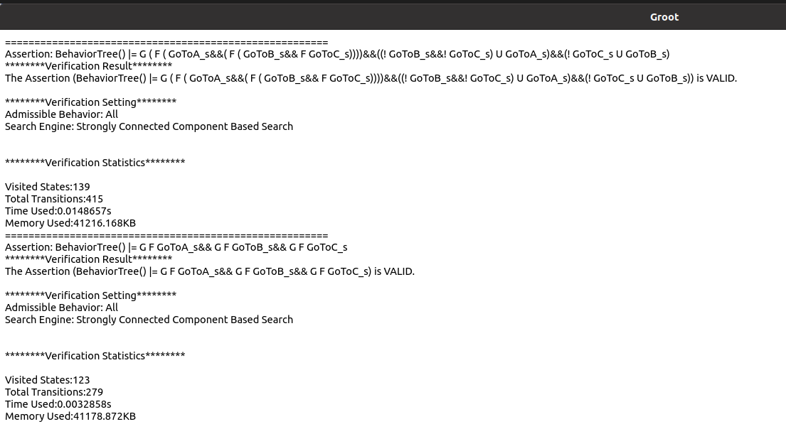
</div>


# [](#header-1)**Contacts**

Please feel free to contact us if you have any questions  about **MoVe4BT**.

*   <font color="#0000FF" size="4">Peishan Huang (huang_ps@nudt.edu.cn)</font>
*   <font color="#0000FF" size="4"> Weijiang Hong (hongweijiang17@nudt.edu.cn)</font>
*   <font color="#0000FF" size="4"> Zhenbang Chen (zbchen@nudt.edu.cn)</font>
*   <font color="#0000FF" size="4"> Ji Wang (wj@nudt.edu.cn)</font>