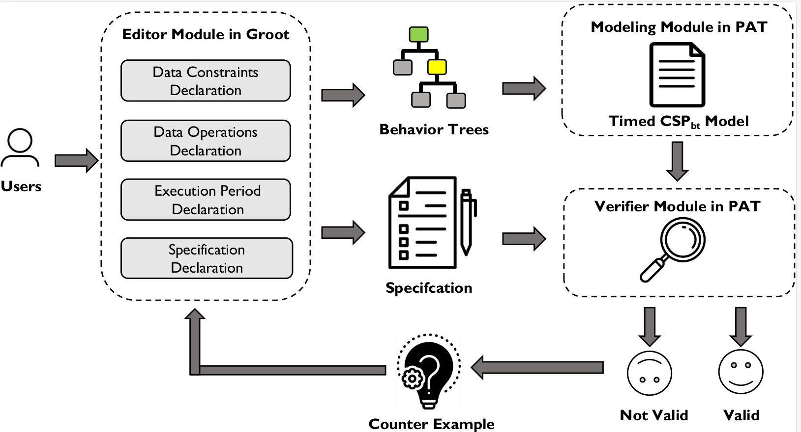

* [**Introduction**](introduction)

* [**Manual**](manual)

* [**Tutorial**](tutorial)

* [**Case Study**](case study)

* [**Paper Materials**](paper materials)

# **Introduction to MoVe4BT**

## **Workflow**

 

 

Firstly, users can create the BT structure and specify the detailed semantics of each node, including the manipulations of data, the data constraints, the execution period, etc. 
Besides, users can also specify the properties for verification, which also includes the timed requirements. 
After completing the modeling of the BT, the corresponding Timed CSPbt model will be automatically generated. 
Then, based on the properties provided by the user, a model checking-based verification process  will be carried out. 
If the model does not satisfy the property, a counterexample will be generated to guide users to fix the errors in BTs.
# **Contacts**

Please feel free to contact us if you have any questions about **MoVe4BT**.

*   Peishan Huang (huang_ps@nudt.edu.cn)

*    Zhenbang Chen (zbchen@nudt.edu.cn)