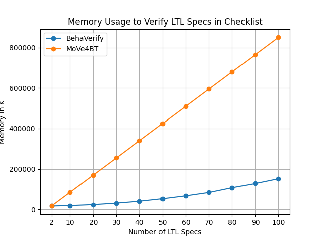
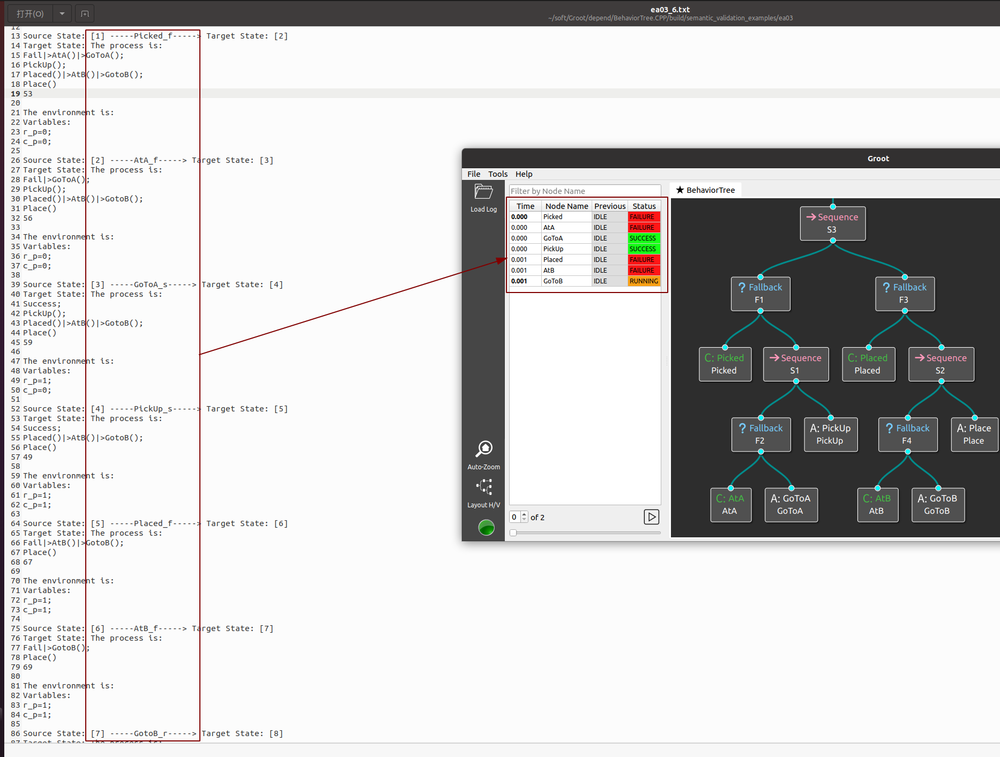

* [**Introduction**](introduction)

* [**Manual**](manual)

* [**Tutorial**](tutorial)

* [**Case Study**](case study)

* [**Paper Materials**](paper materials)

# **Paper Materials**
This chapter provides two additional parts of our paper, including a comparison with paper **BehaVerify: Verifying Temporal Logic Specifications for Behavior Trees** and a partial validation of the semantics of our language.
All the raw data is stored under the [github repository](https://github.com/Huangps/PaperMaterials2023.git) that we created.
## **Comparison With BehaVerify**
**BehaVerify** is an existing work on verification of BTs, which is also based on model checking.

BehaVerify has two types of encoding, one is Leaf and one is Total.
The state of the whole tree in the Total encoding method is computed in one time step. 
As a result, the temporal relationship between BT actions disappears.
So, we only compare with the Leaf coding.

We compare both modeling and verification.
### **Modeling**

|             |         BehaVerify          |      MoVe4BT      |
|:-----------:|:---------------------------:|:-----------------:|
|  Node Type  | Execution,Control,Decorator | Execution,Control |
| Concurrency |             No              |        Yes        |

Compared to BehaVerify, we do not support modeling Decorator nodes.
Although we all support modeling control nodes such as Sequence nodes, Fallback nodes, and Parallel nodes.
However, the mechanism of Parallel nodes is fundamentally different, the child nodes of the Parallel node of BehaVerify are still executed in the order from left to right, while the child nodes of our parallel node truly achieve concurrency.
We also selected BehaVerify examples to model in MoVe4BT, showing that we can model the examples from BehaVerify without Decorator nodes and Parallel nodes.

### **Verification**

|             |    BehaVerify     |       MoVe4BT        |
|:-----------:|:-----------------:|:--------------------:|
| Specifications  | LTL,CTL,Invariant  | LTL,Reachability|

Compared to BehaVerify, we do not support CTL and Invariant verification but support Reachability verification.
We have selected two examples with LTL property verification in BehaVerify, showing that it can also be verified with MoVe4BT.

### **Experiments**

We chose the Checklist in BehaVerify as an example for experimental comparison. 
The reason for not choosing BlueROV was mentioned earlier: because the implementation mechanism of parallel nodes is different, there is no comparison.
Checklist is a series of examples, consisting of many rollback nodes connected by sequence nodes, 
and each rollback node is composed of a condition node and an action node.
The BTs corresponding to Checklist5 and Checklsit10 is shown in the figure below：
<div style="display: flex;">
  
</div>
<div style="display: flex;">

</div>

Each fallback node is designed with two LTL properties for verification, checklisti contains i fallback nodes, 2i LTL properties
```angular2html
G(safetychecki_f->  X(backupi_r || backupi_f || backupi_s));
G(safetychecki_f->  !X(backupi_r || backupi_f || backupi_s));
```


The experimental results are shown in the figure below.

<div style="display: flex;">
  
      
</div>

Our time and memory overhead both grow linearly, while BehaVerify grows exponentially. Among them, our time overhead is much lower than it. When verifying 100 LTL properties, the verification time is 2.184% of BehaVerify. Although current experiments show that our memory overhead is higher than that of BehaVerify, our memory overhead grows linearly. 
As the verification scale increases, our memory overhead will be lower than that of BehaVerify.


## **Semantics Validation**
In this part, we chose [BehaviorTreeCPP](https://github.com/BehaviorTree/BehaviorTree.CPP) as the simulator for BT. 
Use it to simulate the execution of the BT several times, and obtain several corresponding behavior sequences. 
Then use the simulator that comes with MoVe4BT to execute the BT to see if the same behavior sequence can be executed.
Our experimental results prove that the behavior sequence executed by BehaviorTreeCPP is a subset of the behavior sequence executed by MoVe4BT.

However, the Parallel nodes of BehaviorTreeCPP do not really achieve concurrency, and the children of its Parallel nodes are still executed sequentially.
So it is not possible to validate the semantics of our Parallel nodes by using BehaviorTreeCPP.

We made four examples to validate our semantics, two basic: Sequence and Fallback, and two complete examples: Pick_Place and Patrol.
The .fbl file is the behavior sequence executed by BehaviorTreeCPP, which can only be visualized using the [Groot](https://github.com/BehaviorTree/Groot) that comes with BehaviorTreeCPP.
The .txt file is the same behavior sequence executed by MoVe4BT. 

For example, The red box on the left side of the following figure shows the sequence of behaviors executed using MoVe4BT, while the right side of the figure shows the sequence of behaviors executed using BehaviorTreeCPP.
The left side is opened with a text editor, and the right side is opened with Groot's Log-Replay that comes with BehaviorTreeCPP.

<div style="display:flex; justify-content: center;">
  
</div>


# [](#header-1)**Contacts**

Please feel free to contact us if you have any questions about **MoVe4BT**.

*   <font color="#0000FF" size="4">Peishan Huang (huang_ps@nudt.edu.cn)</font>
*   <font color="#0000FF" size="4"> Weijiang Hong (hongweijiang17@nudt.edu.cn)</font>
*   <font color="#0000FF" size="4"> Zhenbang Chen (zbchen@nudt.edu.cn)</font>
*   <font color="#0000FF" size="4"> Ji Wang (wj@nudt.edu.cn)</font>