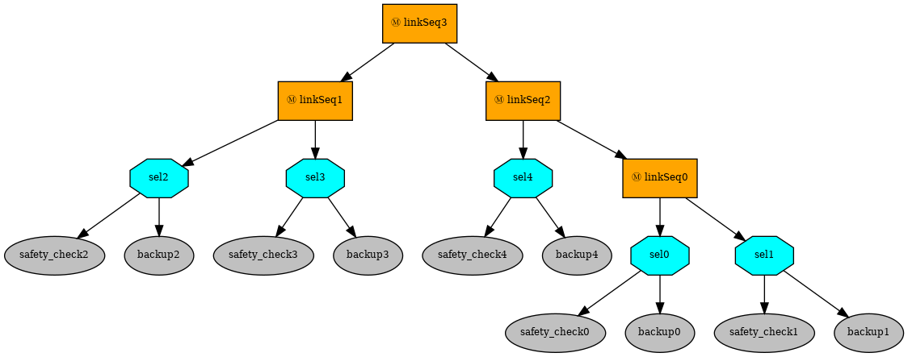
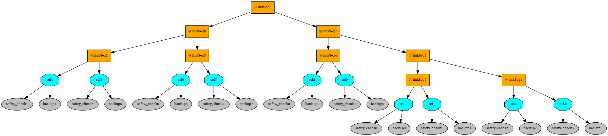
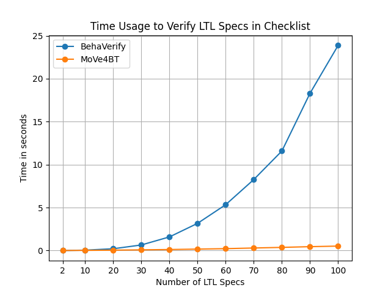
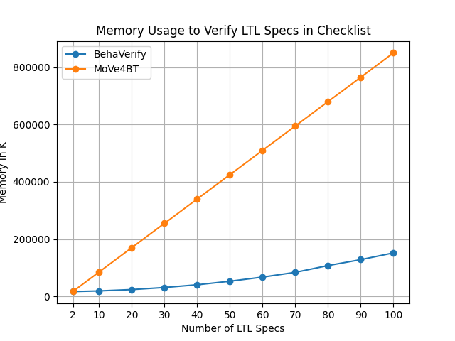
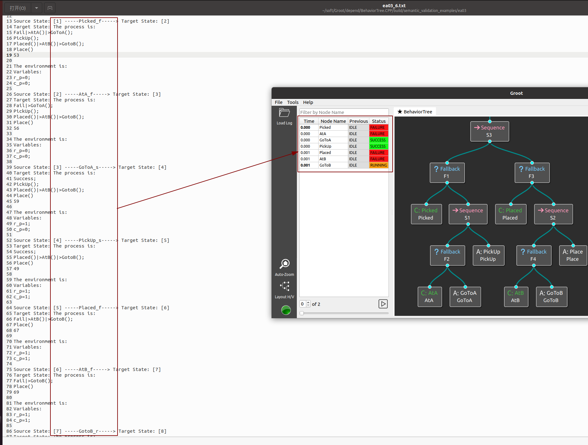

* [**Introduction**](introduction)

* [**Manual**](manual)

* [**Tutorial**](tutorial)

* [**Case Study**](case study)

* [**Supplemental Material**](supplemental material)

# **Supplemental Material**
This chapter provides two parts supplemental materials of our paper:

(1). Comparison with paper **BehaVerify: Verifying Temporal Logic Specifications for Behavior Trees**

(2). Semantics validation of our language.

All the raw data is stored under the [github repository](https://github.com/Huangps/PaperMaterials2023.git) that we created.
## **Comparison With BehaVerify**
**BehaVerify** converts BTs to SMV models and performs model checking-based verification.
It has two types of encoding, one is Leaf and one is Total.
The state of the whole tree in the Total encoding method is computed in one time step. 
As a result, the temporal relationship between BT actions disappears.
So, we choose Leaf coding for comparison.

We compare both modeling and verification.
### **Modeling**

|             |         BehaVerify          |      MoVe4BT      |
|:-----------:|:---------------------------:|:-----------------:|
|  Node Type  | Execution,Control,Decorator | Execution,Control |
| Concurrency |             No              |        Yes        |

Compared to BehaVerify, we do not support modeling Decorator nodes.
Although we all support modeling control nodes such as Sequence nodes, Fallback nodes, and Parallel nodes.
However, BehaVerify encodes parallel nodes as sequential nodes, the child nodes of the Parallel nodes of BehaVerify are still executed in the order from left to right, 
limiting the ability to verify the BTs with parallel nodes.
While the child nodes of our parallel node truly achieve concurrency.


### **Verification**

|             |     BehaVerify      |                 MoVe4BT                 |
|:-----------:|:-------------------:|:---------------------------------------:|
| Specifications  | LTL, CTL, Invariant | LTL, Reachability, Timed Specifications |

Compared to BehaVerify, we do not support CTL and Invariant property verification, but we do support property verification for Reachability and Timed behavior specifications.


### **Evaluation**

We use the Checklist benchmark of BehaVerify for evaluation.
The reason for not choosing the BlueROV benchmark is that it contains parallel nodes.
Checklist is a series of examples, consisting of many fallback nodes connected by sequence nodes, 
and each rollback node is composed of a condition node and an action node.
The BTs corresponding to Checklist5 and Checklsit10 is shown in the figure below(the image is from the website of BehaVerify)：
<div style="display: flex;">
  
</div>
<div style="display: flex;">

</div>

Each fallback node is designed with two LTL properties for verification, checklisti contains i fallback nodes, 2i LTL properties.

```angular2html
G(safetychecki_f->  X(backupi_r || backupi_f || backupi_s));
G(safetychecki_f->  !X(backupi_r || backupi_f || backupi_s));
```

We selected 11 BTs from the Checklist benchmark, namely checklist1, checklist5, ..., checklist50, for our evaluation. 
These BTs progressively increase in scales and properties. We carried out 552 verification tasks (i.e., each task contains a BT and an LTL)
using both approaches.
The evaluation results are shown in the figure below：

<div style="display: flex;">
  
      
</div>


In total, our tool and BehaVerify need 2.32s and 73.07s to finish all the verification tasks, respectively, indicating our tool’s efficiecy. 
Besides, our tool needs more memory than BehaVerify.


## **Semantics Validation**
We validate the correctness of our semantics by comparing it with existing BT simulators [BehaviorTreeCPP](https://github.com/BehaviorTree/BehaviorTree.CPP). 
We used it to execute representative BTs multiple times to generate behavior sequences. 
Then, we use our semantics to obtain the behavior sequences of the same BTs.

We validate that the behavioral sequences generated by the simulator are contained in the sequences generated by our semantics, indicating the correctness of our semantics for verification.
However, the Parallel nodes of BehaviorTreeCPP do not really achieve concurrency, and the children of its Parallel nodes are still executed sequentially.
So it is not possible to validate the semantics of our Parallel nodes by using BehaviorTreeCPP.

We made four examples to validate our semantics, two basic: Sequence and Fallback, and two complete examples: Pick_Place and Patrol.
The .fbl file is the behavior sequence obtained by BehaviorTreeCPP, which can only be visualized using the [Groot](https://github.com/BehaviorTree/Groot) that comes with BehaviorTreeCPP.
The .txt file is the same behavior sequence obtain  by MoVe4BT. 

For example, The red box on the left side of the following figure shows the sequence of behaviors executed using MoVe4BT, while the right side of the figure shows the sequence of behaviors executed using BehaviorTreeCPP.
The left side is opened with a text editor, and the right side is opened with Groot's Log-Replay that comes with BehaviorTreeCPP.

<div style="display:flex; justify-content: center;">
  
</div>


# [](#header-1)**Contacts**

Please feel free to contact us if you have any questions about **MoVe4BT**.

*   <font color="#0000FF" size="4">Peishan Huang (huang_ps@nudt.edu.cn)</font>
*   <font color="#0000FF" size="4"> Weijiang Hong (hongweijiang17@nudt.edu.cn)</font>
*   <font color="#0000FF" size="4"> Zhenbang Chen (zbchen@nudt.edu.cn)</font>
*   <font color="#0000FF" size="4"> Ji Wang (wj@nudt.edu.cn)</font>