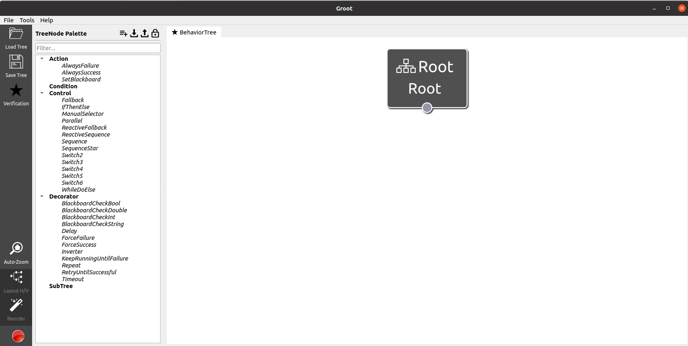
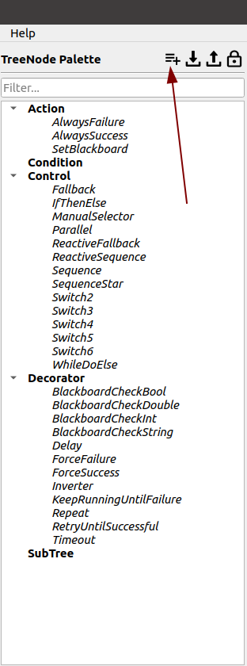
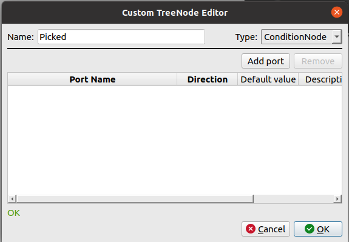
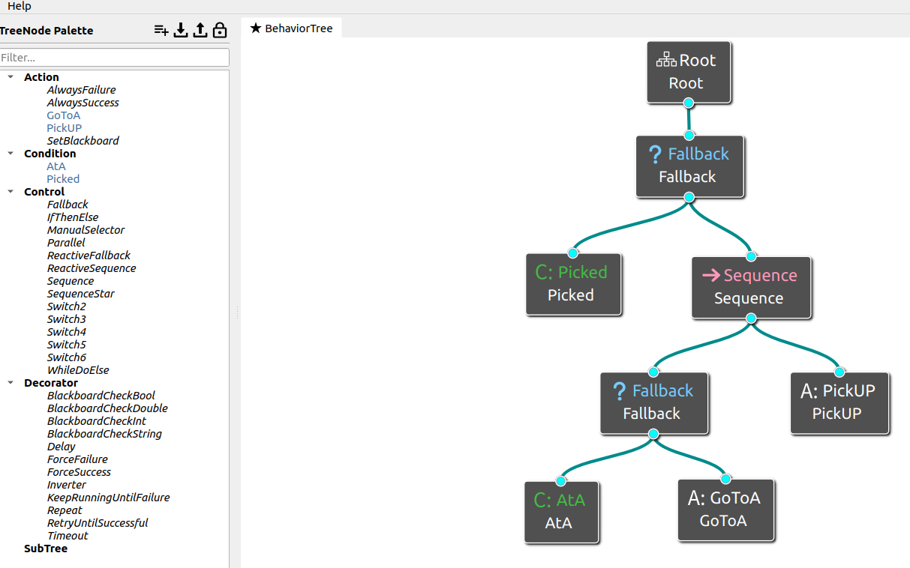
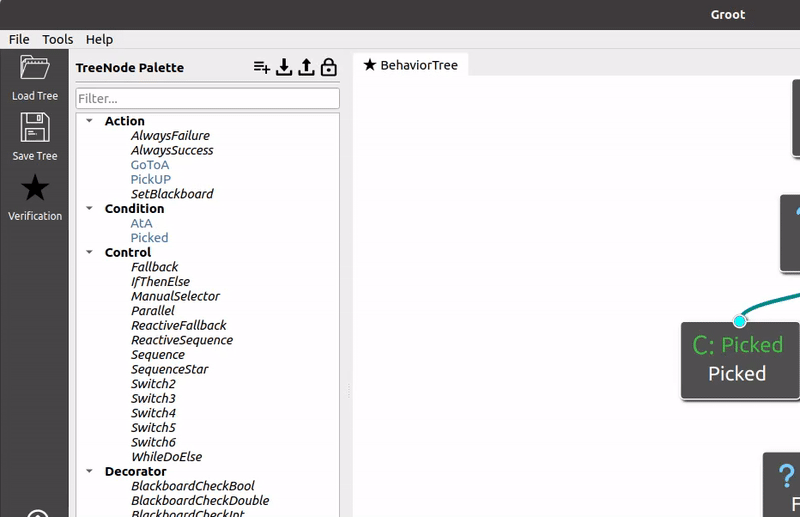
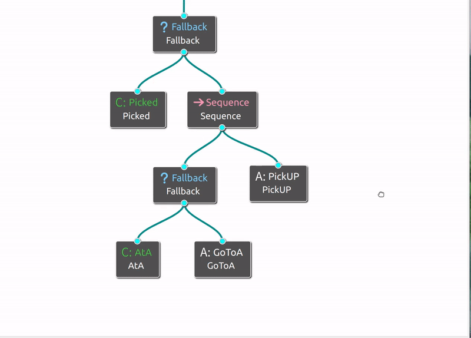
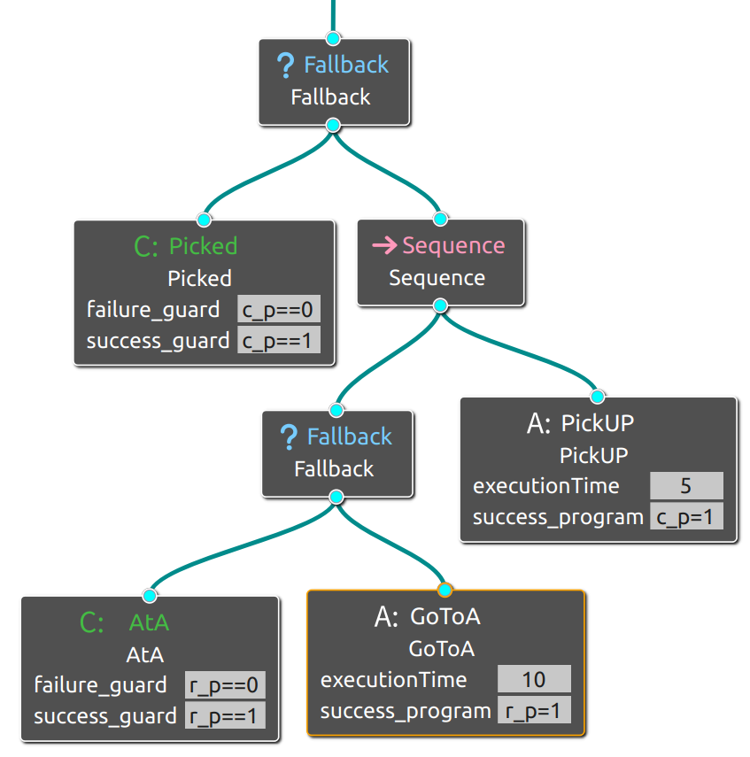
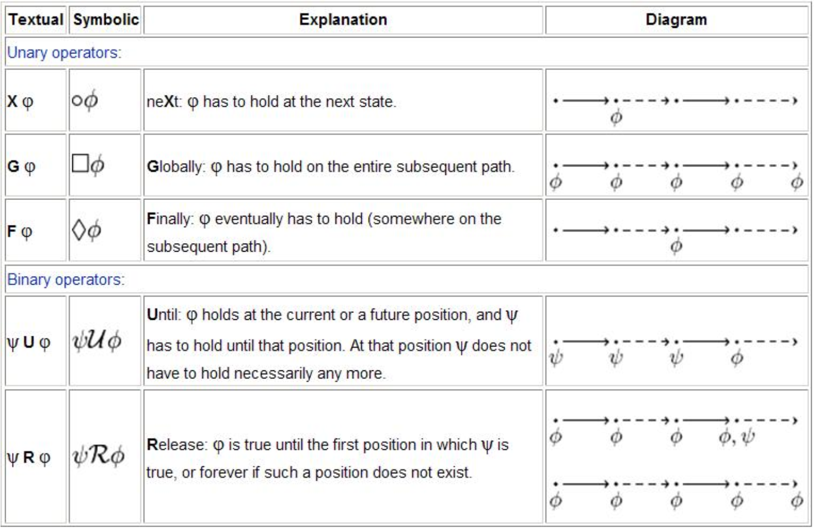
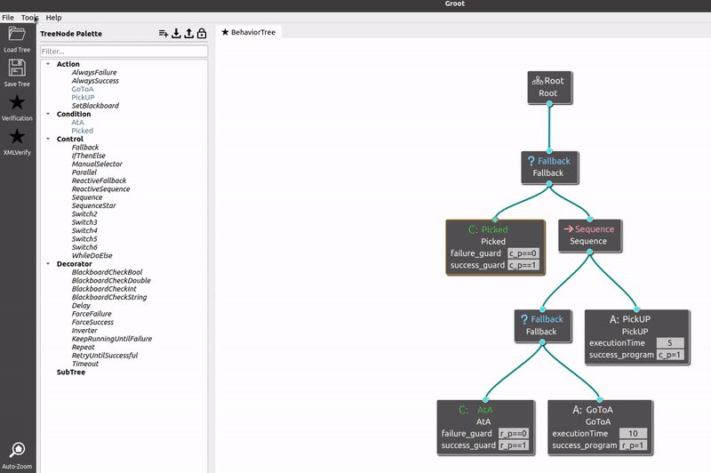
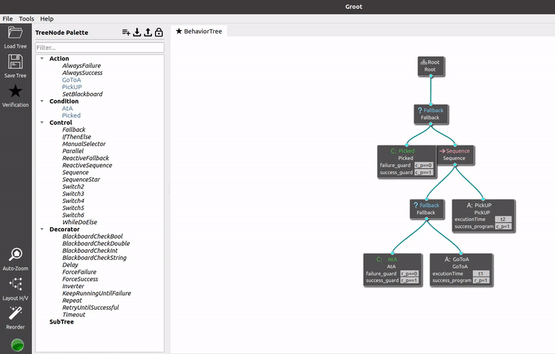

*   [**Introduction**](introduction)

*   [**Manual**](manual)

*   [**Tutorial**](tutorial)

*   [**Case Study**](case study)
# **Tutorials**
We provide an example for using **GrPAT**.
## **Run the GrPAT**
```shell
./Groot
```
Using the above command to run GrPAT, then click the **Editor** button.
After this, you will see the following interface.

<div style="display:flex; flex-direction:row;">
  
</div>

## **The PickUp Example**
This example describes a robot that needs to pick up a cube at location A.

Now, we will illustrate the usage of GrPAT with this simple PickUp example.
We have divided it into three steps：

```
--1. Nodes registration and Constructing BehaviorTree
--2. Variables  declaration 
--3. Nodes semantics embedding 
--4. Input properties 
--5. Start verifying
```
### [](#header-3)**(1). Nodes registration and Constructing BehaviorTree**
The control node has been declared on the left interface earlier. 
Please note that currently only Sequence, Fallback, and Parallel are available.
You can register Action nodes and Condition nodes as needed according to your own requirements.

In this example, we need to register four nodes:
```
--  Condition nodes
-----  Picked      Used to check whether the cube has been picked up
-----  AtA         Used to check  whether the robot is already at location A.

--  Action nodes
-----  GotoA       Robot moves to location A.
-----  PickUp      Robot picks up the cube.
```

First, click on the button indicated by the arrow to add a custom node, enter the node name and select the node type.

<div style="display:flex; align-items:center;">
  
  
</div>


<br>

After registering all the necessary action and condition nodes, 
you can construct a BehaviorTree by combining the already registered control nodes. 
Just drag and drop them onto the right interface and connect them!

<div style="display:flex; align-items:center;">
 
</div>

<br>
<br>

### [](#header-3)**(2). Variables declaration**
We can use variables to model environmental factors, and use constants to define nodes execution time.
```
--  Variables
-----  r_p     robot position,  r_p==0 means robot isn't at A, r_p==1 means robot is at A. Default: r_p=0
-----  c_p     cube position,   r_p==0 means cube is at A, c_p==1 means cube is in the robot arm. Default: c_p=0
```
<div id="gif-container">
  
</div>

Please note that **var** is a keyword. 
Variables need to be assigned using the **=** sign. 
Also, a semicolon **;** needs to be added after each declaration.

The complete input in this example is:
```
var r_p=0; var c_p=0;
```
### [](#header-3)**(3). Nodes semantics embedding**
We designed **guard** port for condition nodes, while action nodes have **guard**, **program**, **time**, and **success threshold** port.
The **guard** specifies the condition the variables should satisfy to produce the event, 
the **program** gives the data operations when the event happens, 
the **time** specifies the action execution period,
and the **success threshold** specifies the action will return success at least once after **N** times executions.
```
--  Guard port
-----  success_guard   if success_guard is satisfied, then executing this node will return success.
-----  failure_guard   if failure_guard is satisfied, then executing this node will return failure.
-----  running_guard   if running_guard is satisfied, then executing this node will return running.   (only Action nodes has this guard port)

--  Program port
-----  success_program   the effect after the execution of the action node returns success
-----  failure_program   the effect after the execution of the action node returns failure
-----  runnning_program  the effect after the execution of the action node returns running

--  Time port
-----  Execuiton time    the execution time of the action node.

--  Success threshold port
-----  Success threshold  the action execution N times can return success at least once. 
```

The **guard** is a quantifier-free first-order logic formula on the data variables like: 
```
c_p==0 && r_p==0
```
The **program** is a program that manipulates the data variables and can be specified in any programming language. 
In our implementation, the **program** is required to be given in C# language like:
```
c_p=1;r_p=1
```
the **time** and **success threshold**  is required to be given in positive integers.

<br>

To add ports to the node, simply right-click on it as shown in the left figure below.
The complete diagram is shown in the right figure below.

<div style="display:flex">
<div id="gif-container">
  
</div>
<div id="gif-container">
  
</div>
</div>

For example, the **failure_guard** of _Picked_ is **c_p==0**, and the **success_guard** is **c_p==1**. 
This means that _Picked_ will only return success if **c_p==1** is satisfied, and if **c_p==0** is met, 
the execution of _Picked_ will return failure, **c_p==1** means that the cube has already been picked up; 
the success_program of _PickUP_ means that after the execution of _PickUP_ node returns success, it will set **c_p** as 1. 

### [](#header-3)**(4). Input properties**

#### [](#header-4)**(a).  LTL properties**

Some LTL's temporal logic operators and their semantics as shown below (Image from [PAT User Manual](https://pat.comp.nus.edu.sg/wp-source/resources/OnlineHelp/htm/index.htm)):
<div style="display:flex; flex-direction:row;">
  
</div>


In this example, if we want to verify that if the robot finds itself not at A, then it  will try move to A,
the input LTL formula is:  
```
#assert BehaviorTree |= G (AtA_f -> X (GoToA_s || GoToA_f || GoToA_r));
```
Here **#assert BehaviorTree |=** are keywords.


#### [](#header-4)**(b). Timed behavior properties**
Our tool supports reachability property verification to verify timed behavior-related properties. 
Reachability verification verifies the reachability properties (i.e., a fragment of LTL) of the model. 
A reachability property specifies that a state is reachable from the initial state.

We now limit the robot to run for only 12 units time in the following way:
  <div style="flex:1;padding-right:5px">
    
  </div>

We can check whether the robot is able to eventually pick up the cube like 

```
#define goal c_p==1;                        //c_p==1 means the cube is in the robot's hand.
#assert DeadlineProcess reaches goal;
```

So, we first define a target state.
Here **#define** is a keyword, **goal** is the name of the target state, you can name whatever you want.
The  **#assert DeadlineProcess reaches**  are keywords too.

<br>
Totally, the input properties of this example are:

```
#assert BehaviorTree |= G( AtA_f -> X( GoToA_s || GoToA_f || GoToA_r ));
#define goal c_p==1;     
#assert DeadlineProcess reaches goal;
```


### [](#header-3)**(5). Start verifying**
You can now click the **Verification** button and wait for the verification results to pop up!
<div id="gif-container">
  
</div>


[//]: # (The final complete PAT input of this example is like below, you can find this in 'input.txt'.)

[//]: # ()
[//]: # (```)

[//]: # (var c_p=0; var r_p=0;)

[//]: # (Picked = [c_p==1]Picked_s->Success [] [c_p==0]Picked_f->Fail;)

[//]: # (AtA = [r_p==1]AtA_s->Success [] [r_p==0]AtA_f->Fail;)

[//]: # (GoToA = Wait[10];&#40;GoToA_s{r_p=1}->Success [] GoToA_f->Fail [] GoToA_r->Running&#41;;)

[//]: # (PickUP = Wait[5];&#40;PickUP_s{c_p=1}->Success [] PickUP_f->Fail [] PickUP_r->Running&#41;;)

[//]: # ()
[//]: # (BehaviorTree= Loop&#40;Picked|>&#40;&#40;AtA|>GoToA&#41;;PickUP&#41;&#41;; //     MainBT)

[//]: # (DeadlineProcess = BehaviorTree deadline[12];)

[//]: # (#assert BehaviorTree |= G&#40; AtA_f -> F &#40;GoToA_s || GoToA_f || GoToA_r&#41;&#41;;)

[//]: # (#define goal c_p==1;)

[//]: # (#assert DeadlineProcess  reaches goal;)

[//]: # (```)

# [](#header-1)**Contacts**

Please feel free to contact us if you have any questions about **GrPAT**.

*   <font color="#0000FF" size="4">Peishan Huang (huang_ps@nudt.edu.cn)</font>

*   <font color="#0000FF" size="4"> Zhenbang Chen (zbchen@nudt.edu.cn)</font>